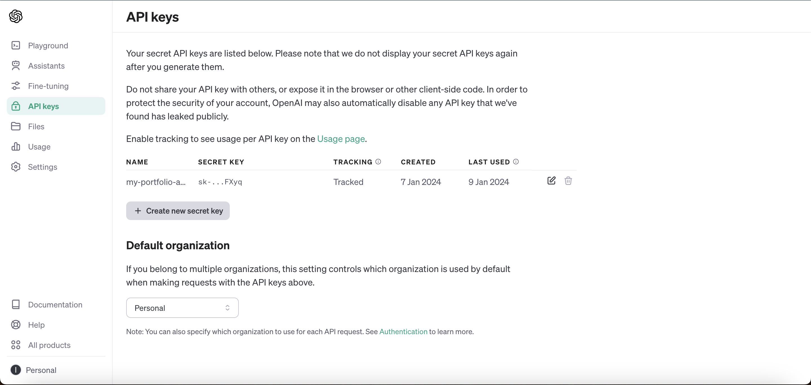
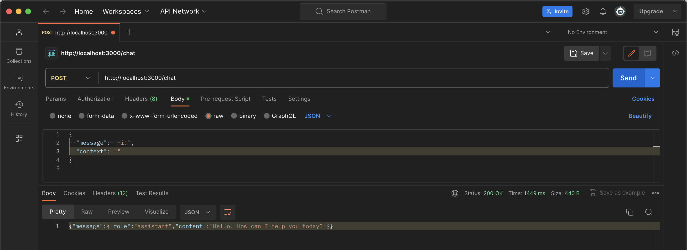

# OpenAI-Chatbot using Express server and OpenAI-API
[](https://skillicons.dev)

#### In this repository I will outline what I learned when implementing a chatbot to my portfolio [website](https://itgelganbold.com)
I will primarily focus on the back-end implementation as the front-end can be done in many different ways depending on your individual needs.

## Obtain an API key

1. Go to [OpenAI platform](https://platform.openai.com/)
2. Click on API keys and then click on ` + Create new secret key `, make sure to copy it somewhere safe!
   
4. Now you can move on to creating the back-end server.


## Build server-side code
1. For this part I will use Express and Node. Make sure you have npm installed. First, make a suitable folder.
```
mkdir ChatbotServer
```
```
cd ChatbotServer
```
2. Initialize the Node project by creating `package.json` and `package-lock.json`.
```
npm init -y
```
3. Install necessary packages.
```
npm install express axios dotenv express-rate-limit openai cors
```
4. Store your API key in a .env file
```
OPEN_AI_API_KEY = <your key goes here>
```
5. Make a JS file, say `server.js` and make the necessary import. (Note: Make sure you have `"type": "module",` in your `package.json`)
```javascript
import express from 'express';
import rateLimit from 'express-rate-limit';
import axios from 'axios';
import dotenv from 'dotenv';
import OpenAI from 'openai';
import cors from 'cors';

// Configure environment variables
dotenv.config();

// Initialize express app
const app = express();
app.use(express.json());
app.use(cors());
```

6. Now, we can import our API key and create an instance of OpenAI object.
```js
// OpenAI API setup
const OPENAI_API_KEY = process.env.OPEN_AI_API_KEY;
const openai = new OpenAI({
    apiKey: OPENAI_API_KEY
});
```

7. To prevent accidental over-use of your API key, it is recommended to use a rate-limiter.
```js
// Rate limit middleware for chat endpoint
const chatLimiter = rateLimit({
    windowMs: 15 * 60 * 1000, // 15 minutes
    max: 30, // limit each IP to 30 requests per windowMs
    standardHeaders: true,
    legacyHeaders: false
});
```

8. Then, we set up our API end-point.
```js
// Chat endpoint
app.post('/chat', chatLimiter, async (req, res) => {
    const userMessage = req.body.message;
    const personalInfo = req.body.context;

/*The above line is optional and is only used to provide
context to your chatbot, for example, this can be a summary
of your CV.
*/

    try {
        const response = await openai.chat.completions.create({
            model: 'gpt-3.5-turbo',        
            messages: [
                { role: 'user', content: userMessage },
                { role: 'assistant', content: personalInfo }

/* The above line is optional.
Note, you need to add the previous messages
each time to your prompt to make it remember the conversation
*/
            ],
            stream: false
        });

        const botResponse = response.choices[0].message;
        res.json({ message: botResponse });
    } catch (error) {
        console.error('Error in OpenAI API call:', error);
        res.status(500).send('An error occurred in generating a response');
    }
});

// Start the server
const PORT = process.env.PORT || 3000;
app.listen(PORT, () => {
    console.log(`Server is running on port ${PORT}`);
});
```

9. Locally, you can your server by running `npm run dev`, but make sure to have `"scripts": {"dev": "node server.js"},`
Now, you can test your server using a tool such as Postman to verify that it is working as intended.


10. Here is an example from my portfolio, where the model is trained on my CV and has been integrated with a basic front-end.

## That's it 🌟! Now, you can deploy your server wherever you'd like and connect it to your front-end. This was a fun project and has hopefully helped you.

